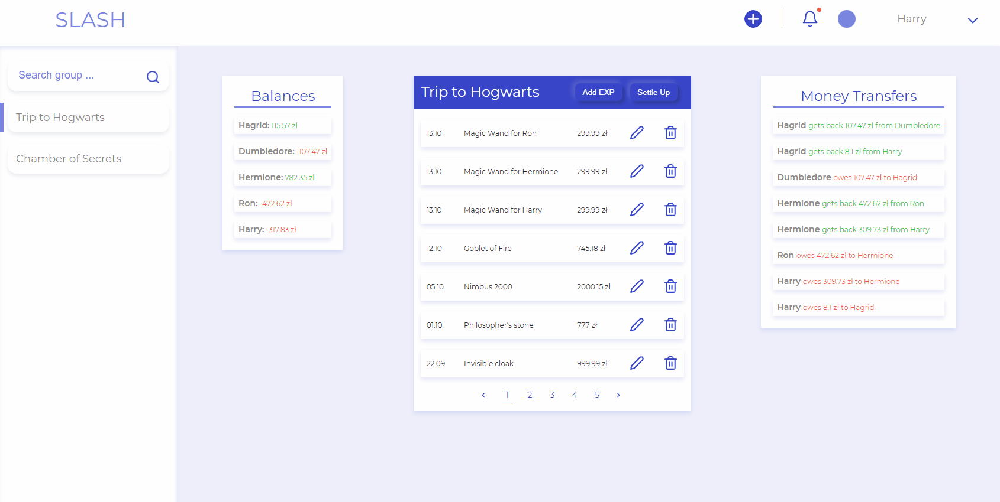
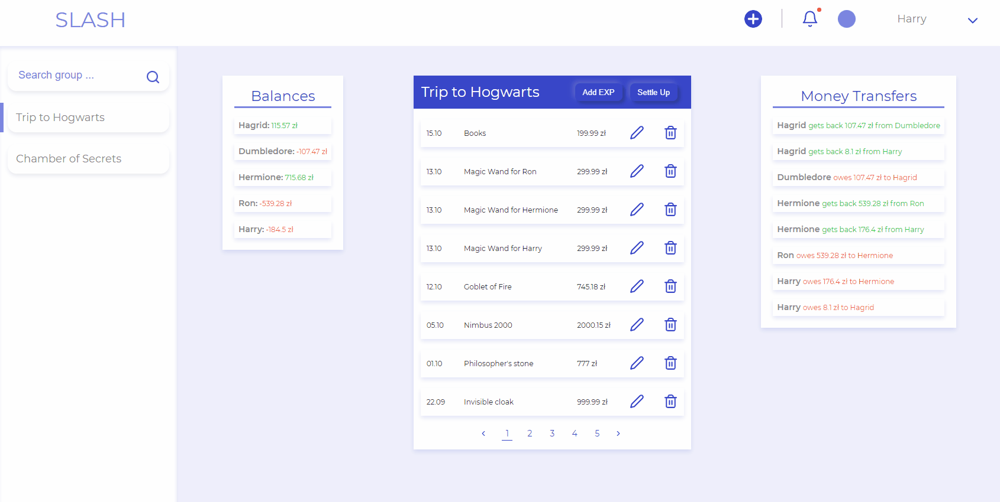
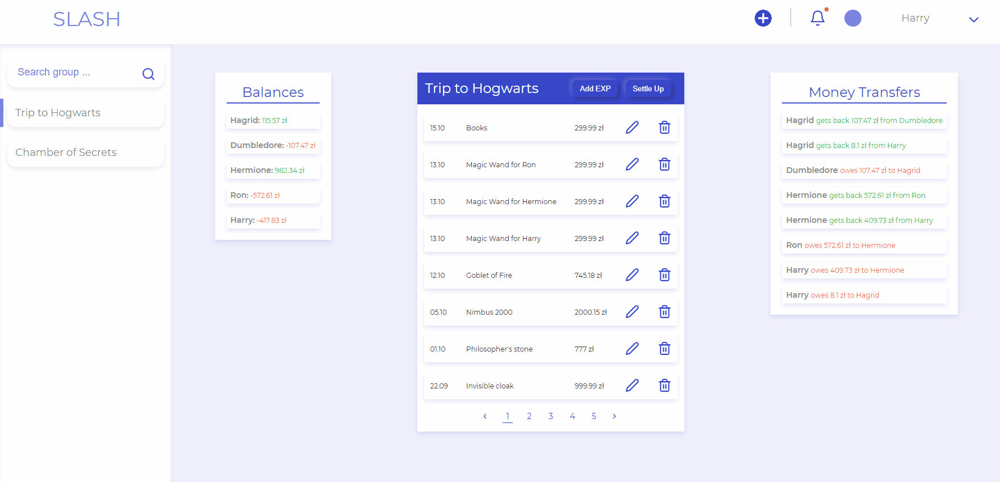
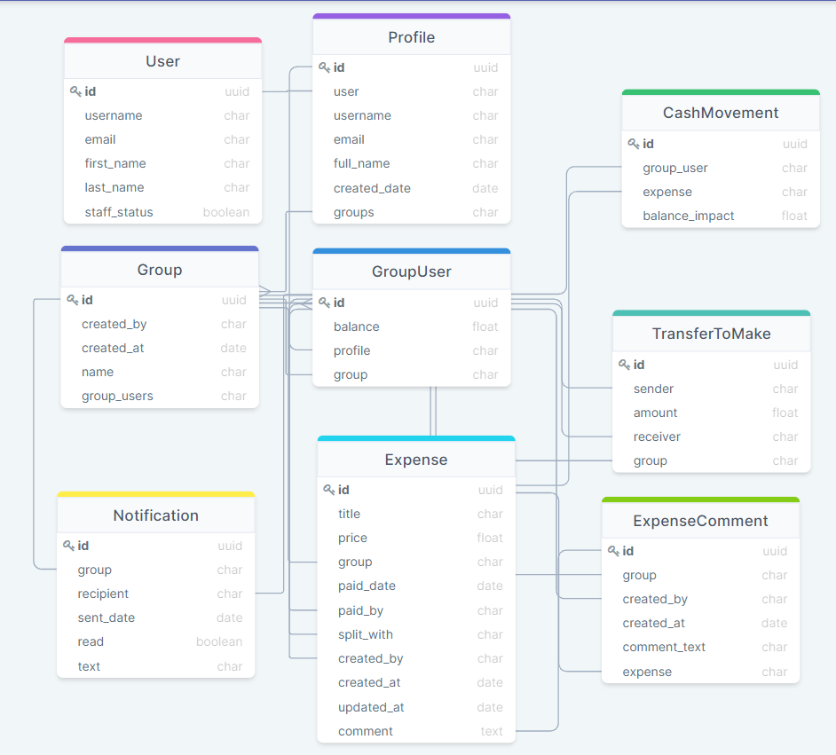

(🔴The project is in live development)
# Introduction

SLASH is a web app built on Django. It's focused on user experience and helps to create groups where users can track their expenses and equally share spendings among all the participants.

---
### Core Features
- Registration
- Login/Logout
- Create/Delete Expense Groups
- Create/Update/Delete Group expense
- Track User balances
- Organize Money Transfers
### Create expense

### Edit Expense

### Settle-up
In order to track the spengings and their coverage, all the users can to settle-up user balances. To recycle existing code settle-up form generates new Expense object which corrects the balances.

The form is already pre-filled with the next priority: logged user debts -> logged user lendings -> other user transfers -> blank form


---

### Django specifics
The whole project is made using Class based views and split in to two apps: users and groups
Users app is taking care of:
* user registration/login/logout
* profile creation/update
* ```users/models.py``` has only Profile model

Groups app is responsible for:
* all functionalities connected to group and expense management
* ```groups/models.py``` have models presented in pic. 1 below

##### pic. 1: database relations


## Processing of an Expense
When user adds, edits or deletes a group expense, all the group user balances have to be adjusted. This is achieved by CashMovement model (db table) which tracks user balance impact caused by the expense and revert changes to balances in case of an update or deletion.

Along with the balance changes, MoneyTransfers have to do be recalculated. This is being managed by the below logic:
```
1) Compute the net amount for every person. The net amount for person ‘i’ can be computed by subtracting sum of all debts from sum of all credits.
2) Find the two persons that are maximum creditor and maximum debtor. Let the maximum amount to be credited maximum creditor be maxCredit and maximum amount to be debited from maximum debtor be maxDebit. Let the maximum debtor be Pd and maximum creditor be Pc.
3) Find the minimum of maxDebit and maxCredit. Let minimum of two be x. Debit ‘x’ from Pd and credit this amount to Pc
4) If x is equal to maxCredit, then remove Pc from set of persons and recur for remaining (n-1) persons.
5) If x is equal to maxDebit, then remove Pd from set of persons and recur for remaining (n-1) persons.
```
The above logic is not a perfect fit for this app and is being used as a placeholder. The logic have the below bugs:
```
1) given set of user balances {'u1': -17, 'u2': -9, 'u3': -9,'u4': 18, 'u5': 17} the logic won't give the minimum amount of transfers ('u1' to match with 'u5' and 'u2', 'u3' with 'u4')
2) splitting 2 expenses worth 100 PLN each amount 3 users won't split equally, but rather {'lender': 133.34 PLN, 'borrower1': 66.68 PLN, 'borrower2': 66.66 PLN}
```